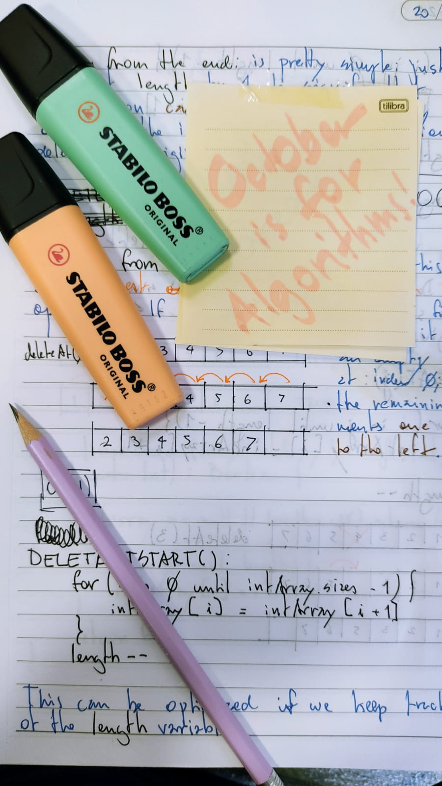

# Data Structures and Algorithms - Kotlin 🤖

Study of Algorithms and Data Structures in Kotlin from several sources (books, leetcode, etc.).

### Data Structures implemented:
  - LinkedList
  - DoubleLinkedList
  - Stack
  - RingBuffer
  - Queues:
    - ArrayListQueue
    - LinkedListQueue
    - RingBufferQueue

### LeetCode challenges
#### Arrays 101
  - Insert into Array
  - Linear search
  - Remove from Array
  - Find Third Maximum
  - In Place Operations
  - Move Zeroes
  - Sort by parity
  - Height Checker

